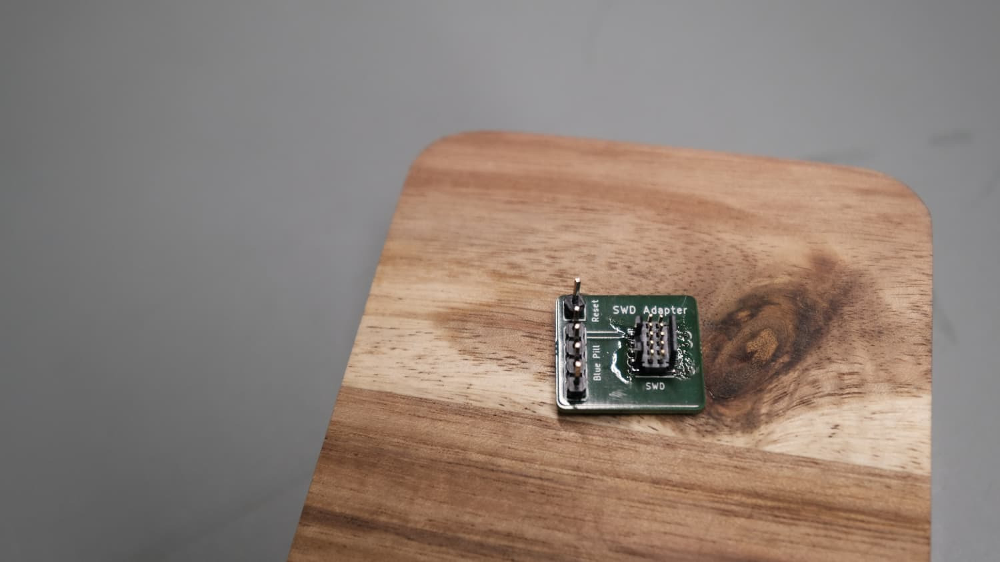

# SWD Adapter

This is a simple adapter board to connect a debug probe with 2x5 1.27mm pitch
connector (like the HS Probe) to a Blue Pill / Black Pill more easily.

This is a [LibrePCB](https://librepcb.org) project!

## BOM

- 1x PCB (you can order from Aisler directly through LibrePCB)
- 1x Adafruit 4048 SWD connector ([Adafruit](https://www.adafruit.com/product/4048), [Digikey](https://www.digikey.ch/en/products/detail/adafruit-industries-llc/4048/9843412))
- 1x Pin header 1x4
- 1x Pin header 1x1

## License

See [LICENSE.txt](LICENSE.txt).
